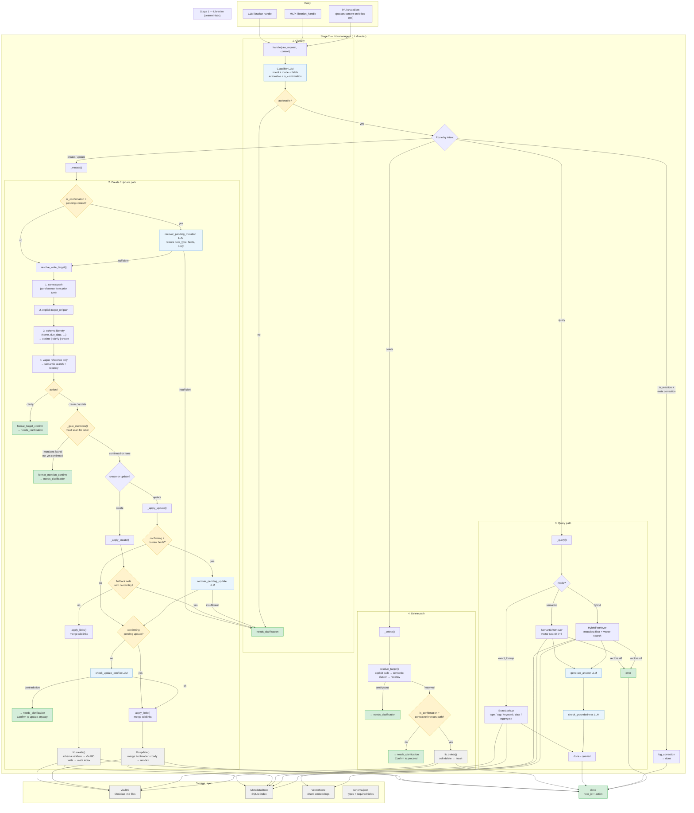
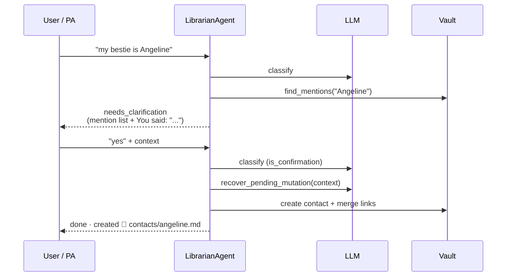

# Stage 2 Architecture Flow

How `LibrarianAgent.handle()` routes free text from entry (CLI / MCP / PA) through the LLM layer into the deterministic Stage 1 `Librarian` core.

## Full flow

## Layer summary

| Layer | Role |
|---|---|
| **Entry** | `CLI` / `MCP` / PA chat — PA must relay `context` on follow-up confirms |
| **Classifier** | One LLM call → intent, fields, `actionable`, `is_confirmation` |
| **Write resolution** | Schema identity before semantic search |
| **Gates** | Mention confirm, conflict check, empty-create guard, delete confirm |
| **Recovery** | `recover_pending_mutation` / `recover_pending_update` for bare `"yes"` turns |
| **Stage 1** | `Librarian` — schema-validated writes, no LLM |
| **Storage** | Vault files + SQLite metadata + optional vectors |

## Confirm loop (stateless)

The agent has no session store. Every follow-up must include the prior librarian message in `context`.

## Key modules

| Module | Responsibility |
|---|---|
| `librarian/agent.py` | Orchestrator — `handle()` and all route methods |
| `librarian/classifier.py` | Intent classification |
| `librarian/write_resolution.py` | Create vs update vs clarify (schema identity first) |
| `librarian/target_resolution.py` | Resolve vague refs for update/delete (semantic + recency) |
| `librarian/mention_search.py` | Word-boundary vault scan for identity labels |
| `librarian/link_resolution.py` | Wikilink merge + mention confirm formatting |
| `librarian/note_preview.py` | One-line note previews for confirm prompts |
| `librarian/llm/context_gate.py` | `context_references_path` for delete/update confirms |
| `librarian/llm/pending_update.py` | Recover pending facts from conversation context |
| `librarian/llm/update_check.py` | LLM conflict detection before updates |
| `librarian/pipeline.py` | Stage 1 `Librarian` — deterministic vault I/O |

## Return contract

Every `handle()` call returns a `HandleResult`:

| Field | Values |
|---|---|
| `status` | `done` · `needs_clarification` · `error` |
| `message` | Human-readable response (relay back to user on clarify) |
| `note_id` | Vault path when applicable |
| `action` | `created` · `updated` · `deleted` · `queried` · `None` |
